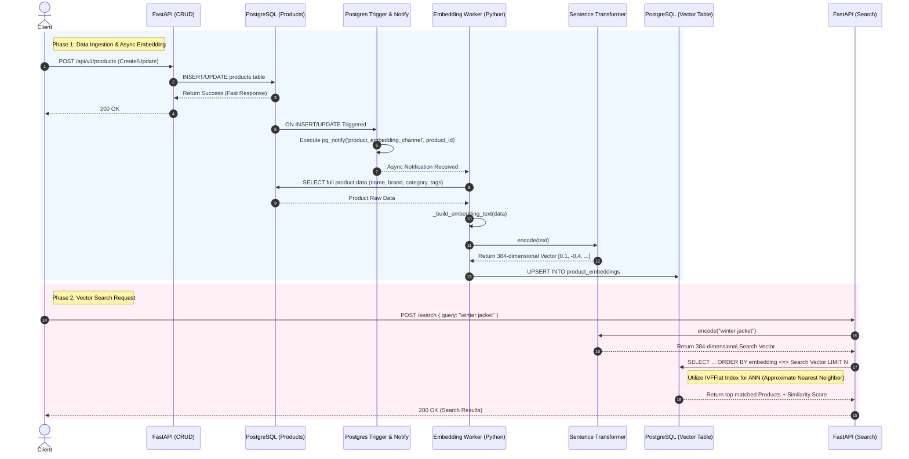

# Product Vector Search Architecture

## 1. Executive Summary

This document outlines the technical architecture of the **Semantic Vector Search** system for Product Management. The system leverages the power of **PostgreSQL (pgvector)** combined with the **Sentence Transformers** (`all-MiniLM-L6-v2`) machine learning model via an **Event-Driven Asynchronous Worker** architecture.

Design Objectives:

1. **Real-time Sync**: Ensure embedding data remains synchronized with the original product data with minimal latency.
2. **Non-blocking API**: The embedding generation process (which is CPU/Memory intensive) must not slow down or block the main CRUD APIs of the FastAPI application.
3. **High Performance Search**: Semantic search queries must achieve high speed (in milliseconds) on large datasets using indexing mechanisms (`ivfflat`).

---

## 2. System Architecture & Component Design

The system follows **Domain-Driven Design (DDD)** with explicit layers and dependency direction (inward):

| Layer | Path | Responsibility |
|-------|------|----------------|
| **Domain** | `src/domain/` | Bounded contexts (`product`, `search`), DTO schemas, repository **ports** (Protocols), domain exceptions |
| **Application** | `src/application/` | Use-case services orchestrating domain ports (no FastAPI, no Prisma) |
| **Interfaces** | `src/interfaces/http/` | FastAPI routers (HTTP adapters); map domain exceptions → HTTP status codes |
| **Infrastructure** | `src/infrastructure/` | Prisma repositories, pgvector SQL, `asyncpg` LISTEN worker, ML encoder adapter |
| **Core** | `src/core/` | Cross-cutting config, shared schemas, FastAPI `Depends` wiring |

**Dependency rule**: `interfaces` → `application` → `domain` ← `infrastructure` (infrastructure implements domain ports).

Bounded contexts:

- **Product**: CRUD use cases via `ProductRepository` port → `PrismaProductRepository`
- **Search**: semantic search via `VectorSearchRepository` + `EmbeddingEncoder` ports
- **Embedding sync**: `EmbeddingWorker` in infrastructure (trigger-driven, outside HTTP request path)

### 2.1 Full Flow Diagram (Mermaid)

The sequence diagram below accurately describes the lifecycle from when a Product is created/updated until it is ready to be semantically searched.



---

## 3. Data Flow & Implementation Details

### 3.1 Data Ingestion Phase (Event-Driven Pipeline)

Embedding Generation consumes significant CPU resources. If the AI model were called directly inside the Create/Update Product API, the Response Time would increase drastically (e.g., from 50ms to 500ms), creating a bottleneck for the system.

**The Solution:**

1. When data modification occurs (INSERT/UPDATE), the Postgres Trigger `trg_product_embedding` automatically executes the `notify_product_change()` function.
2. This function uses PostgreSQL's internal `pg_notify` to push the product ID to a channel named `product_embedding_channel`.
3. During the FastAPI Lifecycle, a Background Task (`EmbeddingWorker`) is launched concurrently using `asyncpg`. This Worker maintains an open connection and LISTENs to the aforementioned channel.
4. Upon receiving a `product_id`, the Worker runs the AI generation independently on an Event Loop `run_in_executor` (preventing main loop blocking), and then upserts the new vector into the `product_embeddings` table.

### 3.2 Semantic Search Phase

The Search Flow utilizes Cosine Similarity (the `<=>` operator in `pgvector`).

1. **Input Normalization:** The Sentence Transformer is configured with `normalize_embeddings=True`. Normalized Vectors make Cosine Similarity calculations more accurate and performant within the Database.
2. **Hybrid Query (Vector + Metadata):** The Search Service does not rely solely on Vectors; it allows Pre-filtering by `status`, `brandId`, and `categoryId`. This creates a true "Hybrid Search" experience.
3. **Core SQL Query:**

```sql
SELECT p.*, 1 - (pe.embedding <=> $1::vector) AS similarity_score
FROM products p
JOIN product_embeddings pe ON pe."productId" = p.id
WHERE p.status = $3::"ProductStatus" AND p."categoryId" = $4
ORDER BY pe.embedding <=> $1::vector
LIMIT $2
```

_(Note: The `<=>` operator returns Cosine Distance. Subtracting the Distance from 1 (`1 - Distance`) yields the Similarity Score)._

---

## 4. Performance Optimization

### 4.1 Indexing with IVFFlat

For large datasets (>10,000 records), using a Sequential Scan to calculate Cosine Distance will slow down the system. The system employs an **IVFFlat (Inverted File with Flat Compression)** Index.

```sql
CREATE INDEX CONCURRENTLY idx_product_embeddings_vector
ON product_embeddings USING ivfflat (embedding vector_cosine_ops) WITH (lists = 100);
```

- **lists = 100**: Divides the Vector space into 100 clusters. During a search, PostgreSQL only compares distances with Vectors located in the nearest cluster(s), reducing the required calculations from $O(N)$ to roughly $O(N / lists)$.
- Highly suitable for Approximate Nearest Neighbor (ANN) search features.

### 4.2 AI Model Caching

The environment variable `HF_HUB_OFFLINE=1` is applied so that the Worker/API does not make network calls to the HuggingFace Hub to check for newer versions upon every startup. The model is completely cached on disk (`.cache/huggingface`), allowing the service startup time to remain in the milliseconds range.
